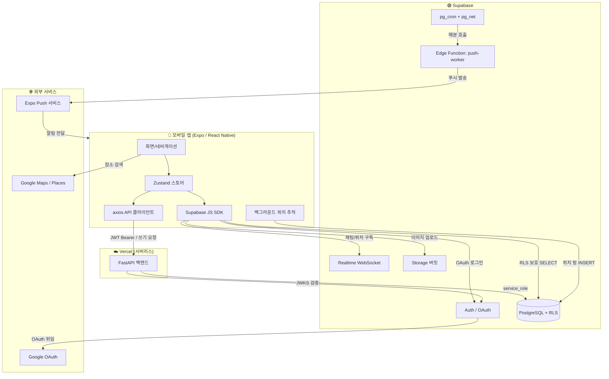
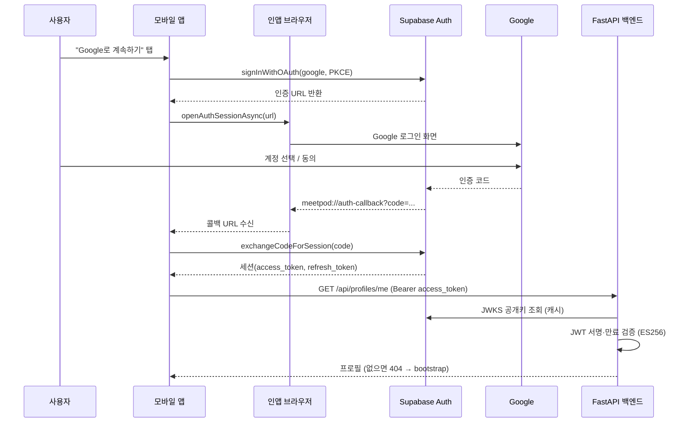
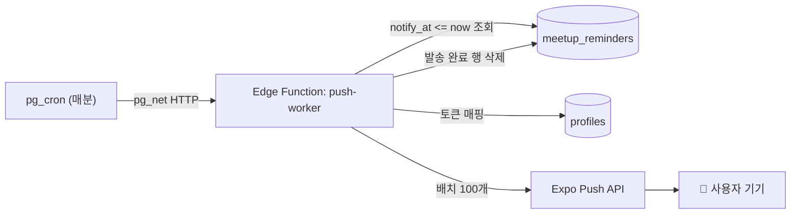
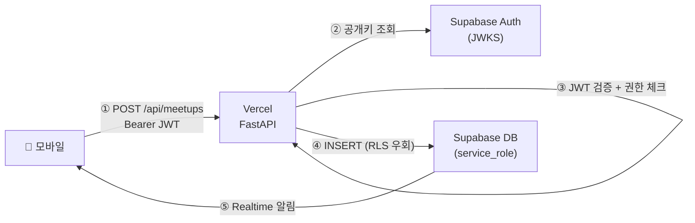

# MeetPod 기술 설명서

> 친구 간 약속 · 실시간 위치 공유 · 채팅 모바일 앱
> 최종 갱신: 2026-05-31

---

## 목차

1. [개요](#1-개요)
2. [시스템 구성도](#2-시스템-구성도)
3. [기술 스택](#3-기술-스택)
4. [인증 시스템 (Google 로그인)](#4-인증-시스템-google-로그인)
5. [백엔드 구조](#5-백엔드-구조)
6. [데이터 모델 & 보안(RLS)](#6-데이터-모델--보안rls)
7. [핵심 기능 동작 원리](#7-핵심-기능-동작-원리)
8. [인프라 역할과 설정 (Supabase · Vercel)](#8-인프라-역할과-설정-supabase--vercel)
9. [배포 구성](#9-배포-구성)
10. [환경 변수](#10-환경-변수)

---

## 1. 개요

MeetPod는 친구들끼리 약속을 잡고, **약속 시간 동안 서로의 위치를 실시간 공유**하며, 그룹·약속 단위로 채팅하는 모바일 앱입니다.

핵심 설계 원칙:

- **권한이 필요한 쓰기**는 FastAPI 백엔드를 경유해 검증한다.
- **실시간 수신**(채팅, 위치 핑)은 Supabase Realtime에 직접 연결한다. (Vercel 서버리스는 WebSocket에 부적합)
- **단일 인증 출처**: 자체 JWT를 발급하지 않고 Supabase Auth가 발급한 토큰만 사용한다.

---

## 2. 시스템 구성도



### 트래픽 분할 원칙

| 경로 | 용도 | 이유 |
|------|------|------|
| 모바일 → **FastAPI** | 그룹/약속 CRUD, 초대, 친구, 알림 등록 | 권한 검증·비즈니스 로직 필요 |
| 모바일 → **Supabase 직결** | 채팅·위치 Realtime 수신, 단순 SELECT | WS는 서버리스 부적합, RLS가 보호 |
| 모바일 → **Supabase Storage** | 채팅 이미지 업로드 | 서명 URL 우회, 직접 업로드 |

---

## 3. 기술 스택

| 레이어 | 기술 |
|--------|------|
| 모바일 | Expo SDK 54, React Native 0.81, TypeScript, React Navigation 7, Zustand 5 |
| 백엔드 | FastAPI 0.115, Python 3.12, supabase-py 2.8+ |
| DB / 인증 / 실시간 | Supabase (PostgreSQL 15, Auth OAuth, RLS, Realtime) |
| 지도 | Google Maps SDK + Places API (New) |
| 푸시 | Expo Notifications + Expo Push 서비스 |
| 배포 | Vercel (백엔드), EAS Build (모바일 앱) |

---

## 4. 인증 시스템 (Google 로그인)

MeetPod의 인증은 **3개 주체**가 협력합니다.

- **모바일 앱**: OAuth 플로우를 띄우고 세션을 받는다.
- **Supabase Auth**: Google 로그인을 위임받고 JWT를 발급한다. (ES256 비대칭 서명)
- **FastAPI 백엔드**: JWT를 검증한다.

### 4.1 전체 로그인 흐름



### 4.2 모바일 측: PKCE 플로우

`supabase-js` v2는 기본적으로 **PKCE(Proof Key for Code Exchange)** 플로우를 사용합니다. 콜백 URL에는 토큰이 아니라 **인증 코드(`code`)**가 담겨오므로, 이를 세션으로 교환해야 합니다.

핵심 코드 ([LoginScreen.tsx](../mobile/src/screens/auth/LoginScreen.tsx)):

```ts
const redirectTo = Linking.createURL('auth-callback');   // meetpod://auth-callback
const { data } = await supabase.auth.signInWithOAuth({
  provider: 'google',
  options: { redirectTo, skipBrowserRedirect: true },
});
const result = await WebBrowser.openAuthSessionAsync(data.url, redirectTo);

if (result.url.includes('code=')) {
  // PKCE 플로우 (supabase-js v2 기본)
  const code = new URL(result.url).searchParams.get('code');
  const { data: d } = await supabase.auth.exchangeCodeForSession(code);
  session = d.session;
} else {
  // Implicit 플로우 fallback (access_token / refresh_token)
  ...
}
await hydrate(session);
```

> ⚠️ **주의**: 과거 implicit 플로우(`access_token`만 파싱)만 처리하면 PKCE 환경에서 토큰이 null이 되어 로그인이 실패합니다. 두 플로우를 모두 처리합니다.

### 4.3 Supabase 측: 설정 요구사항

| 설정 | 값 |
|------|-----|
| Authentication → Providers | Google 활성화 (Client ID / Secret 등록) |
| Authentication → URL Configuration → Redirect URLs | `meetpod://auth-callback` 등록 필수 |
| 앱 scheme | `app.json`의 `scheme: "meetpod"` |

Redirect URL이 등록되지 않으면 Google 로그인 후 앱으로 돌아오지 못합니다.

### 4.4 백엔드 측: JWT 검증 (ES256 + JWKS)

최근 Supabase 프로젝트는 JWT를 **비대칭 ES256(P-256) 키**로 서명합니다. 대시보드에 보이는 "JWT secret"은 HMAC 비밀키가 아니라 **키 ID(kid)**입니다.

따라서 백엔드는 Supabase의 **JWKS 엔드포인트**에서 공개키를 받아 검증합니다 ([jwt_utils.py](../backend/app/utils/jwt_utils.py)):

```
GET {SUPABASE_URL}/auth/v1/.well-known/jwks.json
```

검증 절차:

1. 토큰 헤더에서 `alg`, `kid` 추출
2. `alg == HS256` 이면 레거시 대칭키 경로 (테스트·구버전 호환용)
3. `alg == ES256` 이면 JWKS에서 `kid`에 맞는 공개키를 찾아 `ECAlgorithm`으로 검증
4. `audience == "authenticated"` 확인, `sub`(유저 UUID) 추출

```python
header = jwt.get_unverified_header(token)
alg = header.get("alg", "")        # ES256
kid = header.get("kid", "")
public_key = _get_public_key(kid, alg)   # JWKS에서 httpx로 조회 + 캐시
claims = jwt.decode(token, public_key, algorithms=[alg], audience="authenticated")
user_id = claims["sub"]
```

> ⚠️ **서버리스 환경 주의**: PyJWT의 `PyJWKClient`는 내부적으로 `urllib`을 사용하는데, Vercel 런타임에서 HTTPS를 처리하지 못해 `unknown url type: https` 오류가 납니다. 그래서 **`httpx`로 JWKS를 직접 fetch**하도록 구현했습니다. JWKS 결과는 모듈 전역에 캐시합니다.

> ⚠️ **환경 변수 정제**: Vercel 환경 변수 값에 BOM(``)·공백·개행이 섞이면 `invalid IDNA hostname` / `Invalid API key` 오류가 납니다. `config.py`의 `field_validator`가 `utf-8-sig` 디코딩 + `strip()`으로 모든 Supabase 키를 정제합니다.

### 4.5 인증 의존성

모든 보호 라우트는 `current_user` 의존성을 사용합니다 ([auth.py](../backend/app/dependencies/auth.py)):

```python
def current_user(authorization: str | None = Header(default=None)) -> CurrentUser:
    token = authorization.split(" ", 1)[1].strip()   # "Bearer xxx"
    claims = decode_supabase_jwt(token)
    return CurrentUser(id=claims["sub"], email=claims.get("email"))
```

axios 클라이언트는 매 요청에 자동으로 토큰을 붙이고, 401 시 `refreshSession()` 후 1회 재시도합니다 ([client.ts](../mobile/src/api/client.ts)).

### 4.6 가입(부트스트랩) 흐름

1. 로그인 성공 → `GET /api/profiles/me` 호출
2. 프로필이 없으면(404) → `POST /api/auth/bootstrap`으로 `profiles` 행 생성 (display_name은 Google 이름에서 추출)
3. 닉네임(handle) 미설정이면 → `OnboardingHandleScreen`에서 입력 → `PATCH /api/profiles/me/handle`
4. 닉네임 설정 완료 후 → Expo 푸시 토큰 등록

상태는 `authStore`의 `status` 값으로 관리됩니다: `unknown → unauthenticated / needsHandle / ready`.

---

## 5. 백엔드 구조

레이어드 아키텍처 (PickPod / EasyTaxDocs와 동일한 형태):

```
backend/app/
├── main.py            # FastAPI 앱 생성 + 라우터 등록
├── config.py          # 환경 변수 (Settings) + BOM 정제 validator
├── routers/           # 얇은 HTTP 핸들러 (8개)
│   ├── auth.py        #   POST /api/auth/bootstrap
│   ├── profiles.py    #   GET/PATCH /api/profiles/me, handle, push_token
│   ├── invites.py     #   초대 코드 생성/수락
│   ├── friendships.py #   친구 목록/추가
│   ├── groups.py      #   그룹 CRUD, 멤버/역할
│   ├── meetups.py     #   약속 CRUD, 참여자
│   ├── reminders.py   #   약속별 개인 알림
│   └── chat.py        #   채팅방/메시지, 푸시 토큰
├── services/          # 비즈니스 로직 (라우터는 호출만)
├── models/            # Pydantic 모델
├── dependencies/      # auth(JWT 검증), permissions(역할 체크)
└── utils/
    ├── jwt_utils.py       # ES256 JWKS 검증
    ├── supabase_client.py # service_role 클라이언트
    ├── db.py              # single() — supabase-py maybe_single() 버그 우회
    └── push.py            # send_expo_push() — 채팅/약속초대 즉시 푸시 공통 유틸
```

**규칙**

- 라우터는 얇게 유지하고, 모든 로직은 `services/`에 둔다.
- 모든 API 경로는 `/api` 프리픽스를 가진다.
- DB 조회 시 `app/utils/db.py::single()`을 사용한다 (supabase-py의 `maybe_single()`은 버그 존재).
- 백엔드는 `service_role` 키로 접속하므로 RLS를 우회한다 → **권한 검증은 코드에서 직접** 수행한다.

---

## 6. 데이터 모델 & 보안(RLS)

### 6.1 핵심 테이블

| 테이블 | 용도 |
|--------|------|
| `profiles` | 사용자 (handle, display_name, avatar, expo_push_token) |
| `friendships` | 양방향 친구 (user_a_id < user_b_id 정규화 저장) |
| `invites` | 친구/그룹 초대 코드 (8자, 7일 만료, max_uses) |
| `groups` / `group_members` | 그룹 + 멤버 역할(owner/admin/member) |
| `meetups` | 약속 (group_id가 NULL이면 1회성 약속) |
| `meetup_participants` | 약속 참여자 (status: pending/going/declined — RSVP, share_location 토글) |
| `meetup_reminders` | 사용자별 개인 알림 (발송 후 삭제) |
| `chat_rooms` / `messages` | 채팅방 + 메시지 (text/image/place/system, soft delete) |
| `location_pings` | 위치 핑 (약속별, 24h TTL) |

### 6.2 RLS(Row Level Security) 정책 요지

Supabase 직결 경로의 데이터는 RLS로 보호됩니다.

| 테이블 | SELECT 가능 대상 | 쓰기 가능 대상 |
|--------|------------------|----------------|
| `profiles` | 본인 + 같은 그룹/약속 멤버 | 본인만 |
| `groups` / `group_members` | 그룹 멤버 | owner/admin |
| `meetups` / `meetup_participants` | 참여자 | creator/admin |
| `messages` | 해당 방 멤버 | 멤버(작성), 본인(편집/삭제) |
| `location_pings` | 같은 약속 참여자 | 본인 user_id만 INSERT |

마이그레이션은 `supabase/migrations/001~014`에 순서대로 정의되어 있고, `009_rls_policies.sql`이 정책 본문입니다. `014_participant_rsvp.sql`이 `meetup_participants.status`를 `pending`/`going`/`declined`로 확장합니다.

---

## 7. 핵심 기능 동작 원리

### 7.1 실시간 위치 공유

```mermaid
sequenceDiagram
    participant App as 모바일(백그라운드)
    participant Task as 위치 Task
    participant DB as location_pings
    participant Map as 지도 화면(타 참여자)

    Note over App: 약속 시작 N분 전 진입 감지
    App->>Task: startLocationUpdatesAsync (10초 간격)
    loop 약속 종료까지
        Task->>DB: INSERT 위치 핑 (본인 user_id)
        DB-->>Map: Realtime postgres_changes
        Map->>Map: 지도 핀 갱신
    end
    Note over App: ends_at 도달 → Task 자체 종료
```



- 추적 조건 판정: `shouldTrack()` — `starts_at - location_share_minutes_before` ~ `ends_at` 구간
- 백그라운드 작업: `expo-task-manager`로 OS 레벨 등록, 10초/10m 간격
- 추적 컨텍스트(meetupId, userId, endsAt)는 `expo-secure-store`에 저장
- 권한: 포그라운드 + "항상 허용"(백그라운드). 백그라운드 거부 시 품질 저하 안내
- 위치 핑은 24시간 후 자동 삭제(TTL), RLS가 본인 user_id만 INSERT 허용

구현: [location_tracker.ts](../mobile/src/lib/location_tracker.ts)

### 7.2 채팅 (Realtime)

- 메시지 전송은 백엔드(`/api/chat`) 경유 → 권한 검증 후 INSERT
- 수신은 Supabase Realtime 구독으로 직접:

```ts
supabase.channel(`messages:${roomId}`)
  .on('postgres_changes',
    { event: 'INSERT', schema: 'public', table: 'messages', filter: `room_id=eq.${roomId}` },
    (payload) => pushIncoming(payload.new))
  .subscribe();
```

- 메시지 종류: 텍스트 / 이미지 / 장소(Google Place) / 시스템
- 이미지: `fetch(uri).arrayBuffer()` → Supabase Storage 직접 업로드 (서명 URL + blob 방식은 0바이트 버그가 있어 사용 안 함)
- 그룹 채팅방은 영구, 약속 채팅방은 약속 종료 시 자동 아카이브
- 메시지 INSERT 직후 백엔드가 발신자를 제외한 방 멤버 전원에게 Expo Push 발송 (동기 호출, best-effort — 실패해도 메시지 저장에는 영향 없음)

### 7.3 푸시 알림 (두 가지 경로)

**(A) 즉시 발송 — FastAPI 동기 호출**

채팅 메시지 전송(`chat_service.send_message`)과 약속 초대(`meetup_service.create_meetup` / `add_participants`) 직후, 백엔드가 대상자의 `expo_push_token`을 조회해 Expo Push API를 바로 호출합니다. 공통 로직은 [`app/utils/push.py`](../backend/app/utils/push.py)의 `send_expo_push()`. Edge Function이나 큐를 거치지 않아 지연이 거의 없지만, 발송 실패 시 재시도는 하지 않습니다.

**(B) 예약 발송 — Edge Function + pg_cron (약속 리마인더 전용)**



- `pg_cron`이 매분 `pg_net`으로 `push-worker` Edge Function을 호출
- Edge Function은 `notify_at <= now()`인 알림을 최대 200건 조회 → 토큰 매핑 → Expo Push로 100개씩 배치 발송 → 처리된 행 삭제
- `x-cron-secret` 헤더로 호출 인증

구현: [push-worker/index.ts](../supabase/functions/push-worker/index.ts)

> ⚠️ Expo Go(SDK 53+)는 원격 푸시·백그라운드 위치를 제한하므로 **실제 푸시·위치 테스트는 EAS Build(TestFlight/APK)에서만** 가능합니다. 개발 중에는 로컬 알림(`local_notifications.ts`)으로 대체합니다.

---

## 8. 인프라 역할과 설정 (Supabase · Vercel)

MeetPod의 서버 인프라는 **Supabase**와 **Vercel** 두 축으로 구성됩니다. 두 서비스는 역할이 명확히 분리되어 있습니다.

| 구분 | Supabase | Vercel |
|------|----------|--------|
| 한 줄 역할 | **데이터·인증·실시간 플랫폼** | **백엔드 API 호스팅** |
| 담당 | DB, 인증, Realtime, Storage, 푸시 워커 | FastAPI 서버리스 실행 |
| 상태 | Stateful (데이터 영속) | Stateless (요청마다 콜드 가능) |
| 모바일과의 관계 | 직접 연결(읽기/실시간) + 백엔드 경유(쓰기) | 모바일의 모든 쓰기 요청 수신 |

### 8.1 Supabase의 역할

Supabase는 MeetPod의 **데이터·인증 중심축(single source of truth)**입니다.

| 기능 | 설명 |
|------|------|
| **PostgreSQL + RLS** | 모든 비즈니스 데이터 저장. RLS로 직결 읽기를 행 단위 보호 |
| **Auth (OAuth)** | Google 로그인 위임, ES256 JWT 발급, JWKS 공개키 제공 |
| **Realtime** | 채팅 메시지·위치 핑을 WebSocket으로 구독 전달 |
| **Storage** | 채팅 이미지 버킷(`chat-images`) 저장 |
| **Edge Function** | `push-worker` — 약속 알림을 Expo Push로 발송 |
| **pg_cron + pg_net** | 매분 백그라운드 작업 실행 (상태 전환·푸시·정리) |

#### Supabase 설정 체크리스트

**① 인증 (Authentication)**

- **Providers → Google**: 활성화 후 Google Cloud Console에서 발급한 OAuth Client ID / Secret 등록
- **URL Configuration → Redirect URLs**: `meetpod://auth-callback` **반드시 등록** (없으면 로그인 후 앱 복귀 실패)
- JWT 서명 방식: ES256(비대칭) — 별도 설정 불필요, JWKS는 `/auth/v1/.well-known/jwks.json`에서 자동 제공

**② 데이터베이스 (마이그레이션)**

마이그레이션 `001~013`을 순서대로 적용합니다.

```powershell
cd MeetPod
supabase db reset                  # 로컬: 전체 마이그레이션 재적용
supabase db push --password "..."  # 원격 반영
```

| 파일 | 역할 |
|------|------|
| `001` | 확장 설치 (pg_cron, pg_net 등) |
| `002~007` | 테이블 정의 (profiles ~ location_pings) |
| `008` | Storage 버킷 (`chat-images`) |
| `009` | **RLS 정책 본문** |
| `010` | Realtime publication (구독 대상 테이블 지정) |
| `011~013` | cron 작업 + push-worker 호출 |

**③ Realtime**

`010_realtime_publications.sql`이 `messages`, `location_pings` 등을 `supabase_realtime` publication에 추가합니다. 이 설정이 있어야 모바일의 `postgres_changes` 구독이 동작합니다.

**④ 백그라운드 작업 (pg_cron)**

`supabase/migrations/011_cron_jobs.sql` 기준 등록되는 작업:

| cron job | 주기 | 하는 일 |
|----------|------|---------|
| `meetpod-tick-meetup-status` | 매분 | 약속 상태 전환 (`scheduled→active→ended`) + 종료된 약속 채팅방 아카이브 |
| `meetpod-purge-location-pings` | 매시 17분 | 종료 24시간 지난 위치 핑 삭제 |
| `push-worker` 호출 | 매분 | `pg_net`으로 Edge Function 호출 → 알림 발송 |

> ⚠️ Supabase의 `postgres` 롤은 슈퍼유저가 아니라 `ALTER DATABASE ... SET app.foo = ...`가 불가합니다. 그래서 `013` 마이그레이션은 push-worker URL·시크릿을 함수 본문에 하드코딩하고 `COALESCE(current_setting(..., TRUE), '<하드코딩>')`로 GUC fallback을 둡니다. (EAS Build 완료 후 시크릿 회전 필요 — `CLAUDE.md` Open items 참고)

**⑤ 프로젝트 식별 정보**

| 항목 | 값 |
|------|-----|
| Project Ref | `pogblwrknxxufckdfwaa` |
| API URL | `https://pogblwrknxxufckdfwaa.supabase.co` |
| Edge Function | `push-worker` |

### 8.2 Vercel의 역할

Vercel은 **FastAPI 백엔드를 서버리스 함수로 호스팅**합니다. 데이터는 갖지 않으며, 모바일의 권한성 쓰기 요청을 받아 검증하고 Supabase에 반영하는 **중계·검증 계층**입니다.

#### FastAPI → 서버리스 변환

Vercel은 ASGI 앱을 직접 못 돌리므로 **Mangum 어댑터**로 감쌉니다 ([api/index.py](../backend/api/index.py)):

```python
from mangum import Mangum
from app.main import app
handler = Mangum(app, lifespan="off")
```

라우팅은 [vercel.json](../backend/vercel.json)이 모든 경로를 이 핸들러로 보냅니다:

```json
{
  "version": 2,
  "builds": [
    { "src": "api/index.py", "use": "@vercel/python", "config": { "maxLambdaSize": "50mb" } }
  ],
  "routes": [
    { "src": "/(.*)", "dest": "api/index.py" }
  ]
}
```

> 코드 수정은 **`app/`의 라우터·서비스에서** 하고, `api/index.py`는 진입점이므로 건드리지 않습니다.

#### Vercel 설정 체크리스트

**① 프로젝트**

| 항목 | 값 |
|------|-----|
| 프로젝트 이름 | `meetpod_backend` |
| 팀 | `austins-projects-be59bdd0` |
| 프로덕션 도메인 | `backend-ochre-six-23.vercel.app` |
| 런타임 | Python 3.12 (서버리스) |

> 프로젝트 이름을 바꿔도 `*.vercel.app` 도메인은 유지되므로 모바일의 `EXPO_PUBLIC_API_BASE_URL`은 변경 불필요합니다.

**② 환경 변수 (Settings → Environment Variables)**

Production 스코프에 5개 등록:

| 키 | 비고 |
|----|------|
| `SUPABASE_URL` | |
| `SUPABASE_SERVICE_KEY` | service_role — RLS 우회, 외부 노출 금지 |
| `SUPABASE_JWT_SECRET` | 레거시 HS256용(kid) |
| `FRONTEND_URL` | `meetpod://` |
| `ENV` | `production` |

> ⚠️ **값 입력 주의**: 복사·붙여넣기 시 BOM(``)·공백·개행이 섞이면 `invalid IDNA hostname` / `Invalid API key` 오류가 납니다. 의심되면 값을 삭제 후 **직접 타이핑**하세요. 코드 측에서도 `config.py`의 validator가 `utf-8-sig` + `strip()`으로 방어합니다.

**③ 배포**

```powershell
cd MeetPod\backend
vercel --prod --yes      # 프로덕션 배포 → 자동으로 안정 도메인에 alias
```

배포 후 헬스 체크: `GET https://backend-ochre-six-23.vercel.app/api/healthz` → `{"ok": true}`

### 8.3 두 인프라의 협력 (요청 한 건의 여정)



- **쓰기**: 모바일 → Vercel(검증) → Supabase DB (service_role)
- **읽기/실시간**: 모바일 → Supabase 직결 (RLS가 보호)

---

## 9. 배포 구성

| 구성 요소 | 배포 위치 | 비고 |
|-----------|-----------|------|
| 백엔드 | Vercel 프로젝트 `meetpod_backend` | `api/` 엔트리, 서버리스 Python |
| 모바일 앱 | EAS Build → TestFlight(iOS) / APK(Android) | `eas.json` 프로파일 |
| DB / 인증 / 실시간 | Supabase 프로젝트 `pogblwrknxxufckdfwaa` | |
| 푸시 워커 | Supabase Edge Function `push-worker` | pg_cron이 매분 호출 |

**프로덕션 도메인**: `https://backend-ochre-six-23.vercel.app`

### 배포 명령

```powershell
# 백엔드 (backend 디렉터리에서)
cd MeetPod\backend
vercel --prod --yes

# 모바일 — iOS 빌드 후 TestFlight 제출
cd MeetPod\mobile
npx eas build --platform ios --profile production
npx eas submit --platform ios --latest

# 모바일 — Android APK (내부 배포)
npx eas build --platform android --profile preview
```

### iOS 앱 식별 정보 (`app.json`)

| 항목 | 값 |
|------|-----|
| Bundle Identifier | `com.cpkworks.meetpod` |
| Apple Team ID | `S656J6V43T` |
| EAS Project ID | `7a8ffc12-65cb-4229-953f-59fdece717a4` |
| Owner | `harrycpkworks` |

---

## 10. 환경 변수

### 백엔드 (`backend/.env` / Vercel)

| 키 | 용도 |
|----|------|
| `SUPABASE_URL` | Supabase 프로젝트 URL |
| `SUPABASE_SERVICE_KEY` | service_role 키 (RLS 우회) |
| `SUPABASE_JWT_SECRET` | 레거시 HS256 검증용 (kid) |
| `FRONTEND_URL` | 딥링크 base (`meetpod://`) |

### 모바일 (`mobile/.env`)

`EXPO_PUBLIC_*` 접두사는 JS 번들에 인라인됩니다.

| 키 | 용도 |
|----|------|
| `EXPO_PUBLIC_SUPABASE_URL` | Supabase URL |
| `EXPO_PUBLIC_SUPABASE_ANON_KEY` | anon 공개키 |
| `EXPO_PUBLIC_API_BASE_URL` | 백엔드 API base (`.../api`) |
| `EXPO_PUBLIC_GOOGLE_MAPS_API_KEY` | 지도/장소 검색 |

### Edge Function (`push-worker`)

| 키 | 용도 |
|----|------|
| `SUPABASE_URL` / `SUPABASE_SERVICE_ROLE_KEY` | DB 접근 |
| `PUSH_WORKER_SECRET` | `x-cron-secret` 호출 인증 |

> 모든 `.env*` 파일은 `.gitignore` 처리되며 `*.example`만 커밋됩니다.

---

## 부록: 알려진 함정 (Gotchas)

프로젝트 `CLAUDE.md`에 정리된 핵심 항목:

- **Supabase JWT는 ES256(비대칭)** — "JWT secret"은 kid이지 HMAC 키가 아님
- **supabase-py 2.8.x HTTP/2 끊김 버그** — 2.30.x+로 업그레이드 권장
- **RN `fetch(file://).blob()` 빈 blob** — `arrayBuffer()`로 직접 업로드
- **Expo Go는 원격 푸시·백그라운드 위치 제한** — EAS Build 필수
- **FlatList를 ScrollView 안에 넣으면 크래시** — `View + map` 사용
- **Zustand 셀렉터가 새 배열 리터럴 반환 시 무한 루프** — 안정적 빈 상수 사용
- **Supabase pg_cron은 ALTER DATABASE 불가** — 함수 본문에 하드코딩 + GUC fallback
